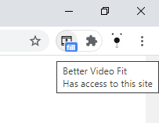

# better-video-fit-chrome-extension
Chrome extension that enable different video fit options

# Motivation

- This is mainly for my 21:9 ultrawide monitor. Chrome browser by default fit video by height, so there will always be two black bars for 21:9 monitor users.  
- Video scaling is not configurable in Google Chrome video player, so 23.8%(5/21) of my screen real estate is pretty much wasted due to lack of browser support.  
- This tool help you fill your screen by stretching or scaling the video.

# Installation
- ~~Chrome Webstore currently charge $5 to sign up, so I am not going to do that.~~  
- You can download this repo and load extension manually as shown in the image below:

# How to use
- Click on the extension icon to toggle different modes 
- You can also toggle modes with `ctrl+shift+A` or `cmd+shift+A`
- Modes:
    - Fill: expand to **fill** entire screen
    - Cover: scale to **cover** entire screen
    - None: source video resolution
    - Default: **default**

# Compatibility
- Work for every video with `<video>` tag (Youtube, Twitch, etc...)
- YouTube always override the video attributes when you expand to fullscreen, use the hotkey to override it again after entering fullscreen.

# Demo
default:

fill:

cover:

none:
