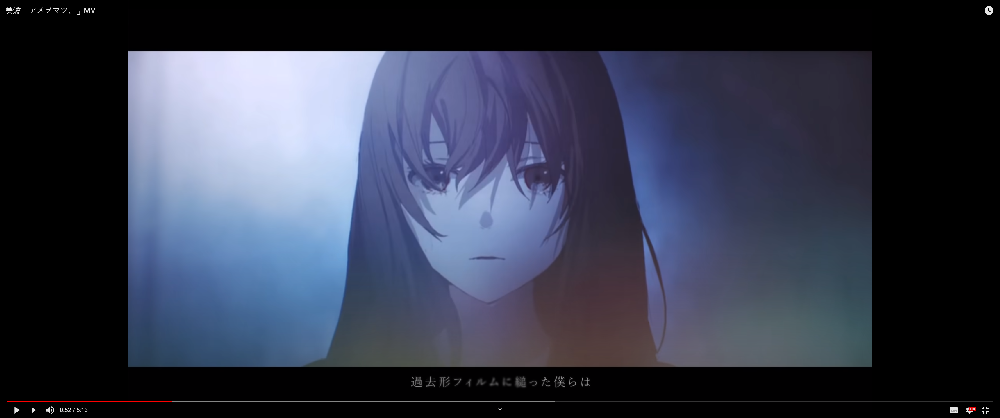

# better-video-fit-chrome-extension
Chrome extension that enable different video fit options

# Motivation
Chrome browser by default fit video by height. There will always be two black bars for 21:9 monitor users.
This is not configurable by default, so 5/21=23.8% of our screen is pretty much wasted due to lack of browser support. This fixes it.

# Installation
Chrome Webstore currently charge $5 to sign up, so I am not going to do that. You can download this repo and load extension manually as shown in the image below:

# Issue
1. Youtube keep reassigning css property when toggling fullscreen... I will fix it sometimes.

# Compatibility
Work every video with <video> tag (Youtube, Twitch, etc...)

# Demo
Before (default setting):

After (scale to fit width)

